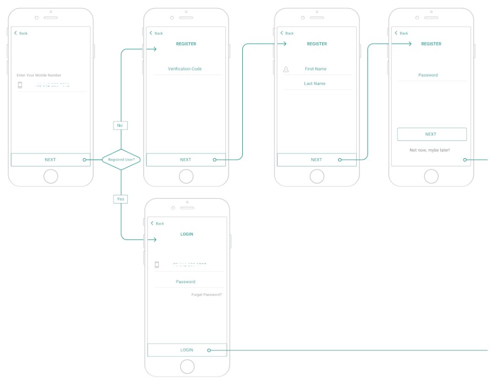

# A4E simple login (TechnicalTask)
An example of Django project with basic user functionality.

## Screenshot


## Functionality

Check user phone number is exists or not
- If phone number is exits, check password
    - If password is ok, give access token and refresh token to user
    - If the password is incorrect, the user can try X times. If they cannot enter the correct password, the user will be banned for Y minutes. 
- If phone number is not exists, send an 6 digit number to user with OTP
    - if user send correct OTP code, register user with first name, last name, email, password then give access token and refresh token to user
    - if user send incorrect OTP code, the user can try X times. If they cannot enter the correct code, the Phone Number and IP will be banned for Y minutes.

### API Endpoints
- `GET /account/login/check_phone_number` : check this phone number is exists or is new.
- `POST /account/login/check_password` : check phone number and password then give access token and refresh token.
- `POST /account/login/check_otp` : check otp code then give access token and refresh token.
- `PATCH/PUT /account/profile/update`: update user profile data

## Installing

### Clone the project

```bash
git clone https://github.com/AmirSajjjad/a4e_login.git
cd a4e_login
```

### Activate virtualenv

#### Create a virtualenv using `venv`

```bash
python -m venv venv

source venv/bin/activate   # For Windows, use: venv\Scripts\activate
```

#### Install dependencies

```bash
pip install -r requirements.txt
```


### Apply migrations

```bash
python simple_login_register/manage.py migrate
```

### Running

```bash
python simple_login_register/manage.py runserver
```
The API will be available at http://localhost:8000/.

## Testing

```bash
python manage.py test
```

## Dockerization

To dockerize the application, you can use Docker and Docker Compose. The configuration files for Docker are provided in the repository.

### Build and Run the Docker Containers

To build and run the Docker containers, use the following command:

```bash
docker-compose up --build
```

## Documentation

The API endpoints are documented using Postman. The Postman documentation is available in the `docs` folder of the project. To view the documentation, follow these steps:

1. Open Postman application.
2. Import the Postman collection and environment files from the `docs` folder.
3. Once imported, you will have access to the detailed documentation of each API endpoint, including request parameters, response examples, and allowed methods.
4. Explore and test the API endpoints directly from the Postman documentation.
